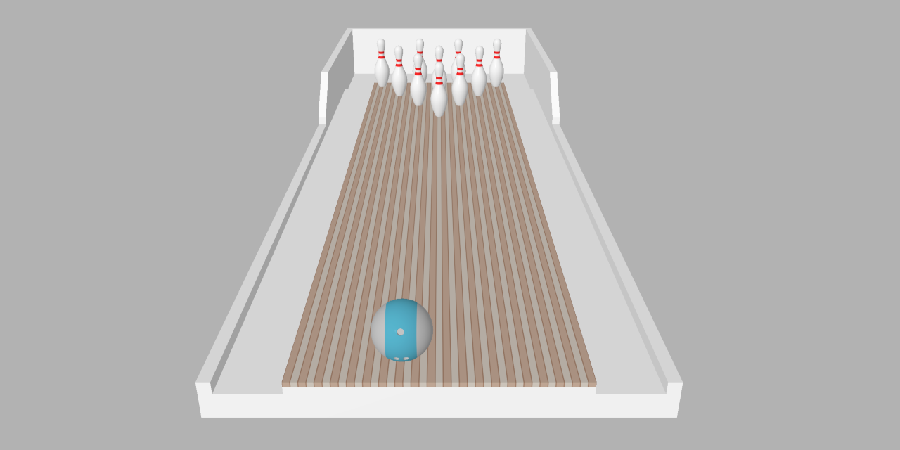

# Bowling

## Description
Simple bowling game for web with accurate physics.

## How to Play
Drag the ball to the left or right to position it.

Flick the ball with your finger to bowl.

## Run
[Open on GitHub Pages](https://iliagrigorevdev.github.io/bowling/)

## Built With
[ammo.js](https://github.com/kripken/ammo.js), direct port of the [Bullet](https://github.com/bulletphysics/bullet3) physics engine to JavaScript using Emscripten.

[three.js](https://github.com/mrdoob/three.js), JavaScript 3D library.
